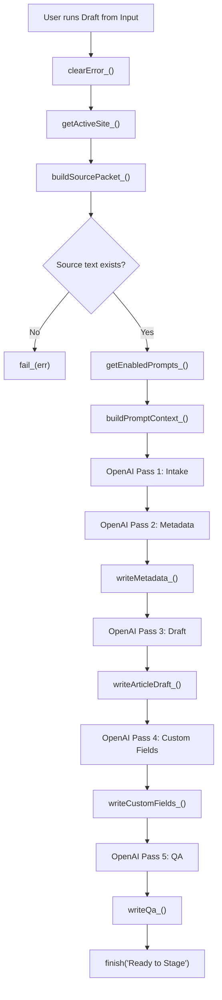

# AI WordPress Publisher - Backend Technical Documentation

Last updated: July 6, 2026  
Spreadsheet: `AI WordPress Publisher - Final Template`  
Spreadsheet ID: `1K8zXlbjJuL0ejB4AQXeuRl--37drlhP3HvyDN1D4MBE`  
Apps Script project: `AI WordPress Publisher`  
Primary script file: `outputs/ai-wordpress-publisher-appscript.gs`

## 1. High-Level Architecture

This system is a Google Sheets-based WordPress publishing console backed by a bound Google Apps Script.

The Sheet is the UI and data store. Apps Script is the backend. OpenAI is used for content transformation. WordPress is the publishing target.

The backend does four major jobs:

1. Reads source material and workflow settings from the Sheet.
2. Sends tiered prompts to OpenAI.
3. Writes AI output back into structured Sheet fields.
4. Builds and sends WordPress REST API payloads.

The main external APIs are:

- Google Sheets via `SpreadsheetApp`
- Google Apps Script `UrlFetchApp`
- OpenAI Responses API at `https://api.openai.com/v1/responses`
- WordPress REST API at `{site_url}/wp-json/wp/v2/{rest_base}`

## 2. Core Components

### Google Sheet

The workbook has four tabs:

- `Publish`
- `Prompts`
- `Setup`
- `Sites`

The Apps Script depends on named ranges in these tabs. The script reads and writes those named ranges rather than hardcoding most individual cell addresses.

### Apps Script

The bound Apps Script is the backend.

It defines:

- menu registration
- action routing
- prompt execution
- OpenAI calls
- WordPress REST calls
- field mapping
- status/error handling
- test functions

### OpenAI

OpenAI is called only during `Draft from Input` and `Test: OpenAI + WordPress Draft`.

It is not called during:

- `Stage Draft`
- `Publish / Update`
- `Pull Existing Post`
- `Clear Intake`
- `Test: WordPress Draft Only`

### WordPress

WordPress is called during:

- `Stage Draft`
- `Publish / Update`
- `Pull Existing Post`
- `Test: WordPress Draft Only`
- `Test: OpenAI + WordPress Draft`

The script authenticates with WordPress using Basic Auth:

```text
username:application_password
```

encoded with `Utilities.base64Encode`.

## 3. Global Configuration Object

The script starts with a global `AWP` object.

```javascript
const AWP = {
  sheets: {
    publish: 'Publish',
    prompts: 'Prompts',
    setup: 'Setup',
    sites: 'Sites'
  },
  actions: {
    draft: 'Draft from Input',
    stage: 'Stage Draft',
    publish: 'Publish / Update',
    pull: 'Pull Existing Post',
    clear: 'Clear Intake'
  },
  openAiModels: ['gpt-5.5-mini', 'gpt-5.5', 'gpt-4.1-mini']
};
```

This object centralizes:

- tab names
- user-facing action names
- OpenAI model fallback order

If a model is invalid or unavailable, the script tries the next model in the list if the error message looks model-related.

## 4. Menu Registration

Function:

```javascript
onOpen()
```

When the spreadsheet opens, Apps Script runs `onOpen()` and creates the `AI Publisher` menu.

Menu items:

- `Run Selected Action`
- `Draft from Input`
- `Stage Draft`
- `Publish / Update`
- `Pull Existing Post`
- `Clear Intake`
- `Test: OpenAI + WordPress Draft`
- `Test: WordPress Draft Only`

This is why the Sheet must be refreshed after Apps Script is installed or updated. The custom menu is registered on open.

## 5. Main Action Router

Function:

```javascript
runSelectedAction()
```

This is the generic menu action.

It reads:

```javascript
readNamed_('ACTION_TO_RUN')
```

Then routes to one of:

- `draftFromInput()`
- `stageDraft()`
- `publishOrUpdate()`
- `pullExistingPost()`
- `clearIntake()`

If the action cell is blank, it defaults to:

```text
Draft from Input
```

If the action value does not match a known action, the script throws:

```text
Unknown action: {action}
```

## 6. Named Range Access Layer

The script uses three helper functions for named ranges.

### `readNamed_(name)`

Reads a named range and returns its displayed value as a trimmed string.

Important behavior:

- It uses `getDisplayValue()`.
- It returns strings.
- It throws if the named range is missing.

This means dropdown labels and visible cell output are what the script sees.

### `writeNamed_(name, value)`

Writes a value into the first cell of a named range.

Important behavior:

- It writes only to `range.getCell(1, 1)`.
- It throws if the named range is missing.

### `rangeValues_(name)`

Reads a full named range table with `getValues()`.

Used for:

- custom field output table
- field map table

## 7. Site Resolution

Function:

```javascript
getActiveSite_()
```

This function reads the `Sites` tab and returns the active site configuration.

### Step-by-step

1. Opens the `Sites` tab.
2. Reads the full table with `getDataRange().getValues()`.
3. Normalizes the header row with `normalizeHeader_()`.
4. Finds the first non-empty site row where `Active` is `TRUE`.
5. If no `Active` column exists, it treats the first non-empty site row as active.
6. Extracts the site values by normalized header names.
7. Applies fallback values from the `Setup` tab where appropriate.
8. Validates required credentials.

### Required values

The active site row must have:

- URL
- WordPress username
- WordPress application password
- OpenAI key

If any are missing, the function throws an explicit error.

### Returned site object

The returned object includes:

```javascript
{
  rowIndex,
  url,
  name,
  username,
  appPass,
  openAiKey,
  openAiModel,
  postType,
  restBase,
  status,
  authorId,
  categoryTaxonomyBase,
  tagTaxonomyBase
}
```

### Security note

This prototype reads credentials directly from the `Sites` tab. That is fast and convenient, but it means the Sheet itself contains sensitive credentials.

Do not share the Sheet with anyone who should not have access to those credentials.

## 8. Main AI Draft Flow

Function:

```javascript
draftFromInput()
```

This is the core AI workflow.

It does not publish to WordPress by itself. It prepares the draft fields in the Sheet.

### Full execution order

1. Clears prior error message.
2. Sets status to `Drafting`.
3. Resolves active site with `getActiveSite_()`.
4. Builds source packet with `buildSourcePacket_()`.
5. Throws if source text is empty.
6. Loads enabled prompts with `getEnabledPrompts_()`.
7. Builds base prompt context with `buildPromptContext_()`.
8. Runs the Intake prompt.
9. Runs the Metadata prompt.
10. Writes metadata fields to the Sheet.
11. Runs the Draft prompt.
12. Writes article body and source notes to the Sheet.
13. Runs the Custom Fields prompt.
14. Writes custom field values to the Sheet.
15. Runs the QA prompt.
16. Writes editor notes to the Sheet.
17. Sets status to `Ready to Stage`.

### Flow diagram



## 9. Source Packet Builder

Function:

```javascript
buildSourcePacket_()
```

Reads:

- `INPUT_URL`
- `INPUT_TEXT`

### URL behavior

If `INPUT_URL` starts with `http://` or `https://`, the script tries to fetch it.

It uses:

```javascript
UrlFetchApp.fetch(url, {
  followRedirects: true,
  muteHttpExceptions: true,
  headers: { 'User-Agent': 'AI WordPress Publisher/1.0' }
})
```

If the fetch succeeds with HTTP 2xx:

- HTML is stripped with `stripHtml_()`.
- fetched text is clipped to 45,000 characters.

If the fetch fails:

- the failure message is included in the source packet
- the workflow can still continue if pasted text exists

### Pasted text behavior

Pasted text is clipped to 70,000 characters.

This is the preferred input path because it is more reliable and cheaper than web fetching.

### Returned object

```javascript
{
  url,
  pasted,
  fetched,
  text
}
```

The `text` value combines:

- source URL
- fetched text
- pasted text/notes

separated by:

```text
---
```

## 10. Prompt Loading

Function:

```javascript
getEnabledPrompts_()
```

Reads:

```text
Prompts!A5:E10
```

Each row is interpreted by:

- column A: pass name
- column B: enabled flag
- column D: prompt text

Rows only run if `On?` is `TRUE`.

The function maps prompt rows into:

```javascript
{
  system,
  intake,
  metadata,
  draft,
  customFields,
  qa
}
```

## 11. Prompt Placeholder Replacement

Function:

```javascript
fillPrompt_(template, values)
```

This replaces placeholders like:

```text
{SITE_NAME}
{SOURCE_TEXT}
{FIELD_MAP}
```

with runtime values.

The replacement is a plain global string replacement using a generated regular expression for each key.

The base context is created by:

```javascript
buildPromptContext_(site, sourcePacket)
```

Base context keys:

```javascript
{
  SITE_NAME,
  EDITORIAL_VOICE,
  POST_TYPE,
  REST_BASE,
  SOURCE_URL,
  SOURCE_TEXT,
  FIELD_MAP,
  ACTION
}
```

Later passes add more context:

- Metadata pass adds `SOURCE_PACKET`
- Draft pass adds `METADATA`
- Custom Fields pass adds `DRAFT_FIELDS`
- QA pass adds `ARTICLE_BODY` and `CUSTOM_FIELDS`

## 12. OpenAI API Layer

Primary functions:

```javascript
callOpenAiJson_(site, prompt, maxOutputTokens)
callOpenAiJsonWithModel_(apiKey, model, prompt, maxOutputTokens)
extractResponseText_(response)
parseJsonLoose_(text)
extractFirstJsonObject_(raw)
```

### Model fallback

`callOpenAiJson_()` builds the model list.

If the site row specifies an OpenAI model, that model is tried first.

Otherwise, the global fallback list is used:

```text
gpt-5.5-mini
gpt-5.5
gpt-4.1-mini
```

If a model-related error occurs, the script tries the next model.

If the error is not model-related, the script stops and throws.

### API request

The script calls:

```text
POST https://api.openai.com/v1/responses
```

Payload shape:

```javascript
{
  model,
  input: "Return only valid JSON. Do not wrap it in Markdown.\n\n" + prompt,
  max_output_tokens,
  store: false
}
```

Important details:

- `store: false` is set.
- The API key is sent as a bearer token.
- The script expects JSON output from the model.

### Response parsing

The script first parses the OpenAI API response body as JSON.

Then it extracts the model text from either:

- `response.output_text`
- nested `response.output[].content[].text`
- nested `response.output[].content[]` where type is `output_text`

Then it attempts to parse the extracted model text as JSON.

If the model includes extra prose, `parseJsonLoose_()` calls `extractFirstJsonObject_()` to find the first balanced JSON object.

This is intentionally tolerant because models sometimes return valid JSON plus a short extra sentence.

## 13. Prompt Passes In Detail

### Pass 1: Intake

Called inside:

```javascript
draftFromInput()
```

Prompt built from:

```javascript
fillPrompt_(prompts.system, context)
+ "\n\n"
+ fillPrompt_(prompts.intake, context)
```

Max output tokens:

```text
2500
```

Expected JSON shape:

```json
{
  "source_notes": "short editor-facing summary",
  "main_facts": ["fact"],
  "entities": ["people, organizations, places, laws, datasets, products"],
  "dates": ["date or time reference"],
  "source_urls": ["url or source name"],
  "known_unknowns": ["uncertain or missing fact"],
  "do_not_overstate": ["claim boundary"]
}
```

Output variable:

```javascript
intake
```

This result is not directly written to many user-facing fields. It becomes grounding context for later passes and contributes known unknowns to QA notes.

### Pass 2: Metadata

Prompt context adds:

```javascript
SOURCE_PACKET: JSON.stringify(intake, null, 2)
```

Prompt built from:

```javascript
fillPrompt_(prompts.system, metadataContext)
+ "\n\n"
+ fillPrompt_(prompts.metadata, metadataContext)
```

Max output tokens:

```text
2500
```

Expected JSON shape:

```json
{
  "title": "factual headline",
  "slug": "wordpress-slug",
  "excerpt": "1-2 sentence excerpt",
  "category_terms": ["term"],
  "tags": ["reusable tag"],
  "featured_media_idea": "literal editorial image idea or empty string",
  "author_id": "numeric ID or empty string",
  "confidence": "low|medium|high"
}
```

Handler:

```javascript
writeMetadata_(metadata)
```

Writes:

- `DRAFT_TITLE`
- `DRAFT_SLUG`
- `EXCERPT`
- `CATEGORY_TERMS`
- `TAGS`
- `FEATURED_MEDIA`
- `AUTHOR_ID`

The mapper is tolerant. It can unwrap nested objects like:

- `metadata`
- `wordpress`
- `post`
- `fields`

It also accepts alternate keys like:

- `headline`
- `seo_title`
- `meta_description`
- `categories`
- `terms`
- `featured_image_url`
- `featured_image_id`

### Pass 3: Draft

Prompt context adds:

```javascript
METADATA: JSON.stringify(metadata, null, 2)
```

Prompt built from:

```javascript
fillPrompt_(prompts.system, draftContext)
+ "\n\n"
+ fillPrompt_(prompts.draft, draftContext)
```

Max output tokens:

```text
9000
```

Expected JSON shape:

```json
{
  "article": "WordPress-friendly HTML body",
  "source_notes": "brief note on source handling or empty string"
}
```

Handler:

```javascript
writeArticleDraft_(draft)
```

Writes:

- `ARTICLE_BODY`
- `SOURCE_NOTES`

The mapper accepts:

- `article`
- `body`
- `content`
- `post_body`
- `html`
- `markdown`

If the article content is nested, it tries to pick:

- `html`
- `markdown`
- `body`
- `content`
- `text`

### Pass 4: Custom Fields

Prompt context adds:

```javascript
DRAFT_FIELDS: collectDraftSnapshot_()
FIELD_MAP: JSON.stringify(getFieldMap_(), null, 2)
```

Prompt built from:

```javascript
fillPrompt_(prompts.system, fieldContext)
+ "\n\n"
+ fillPrompt_(prompts.customFields, fieldContext)
```

Max output tokens:

```text
3500
```

Expected JSON shape:

```json
{
  "fields": {
    "field_key": {
      "value": "value to send, or empty string",
      "notes": "why this value is supported or what human input is needed"
    }
  }
}
```

Handler:

```javascript
writeCustomFields_(customFields)
```

Reads:

- `CUSTOM_FIELDS_OUTPUT`

Writes into the custom fields output table:

- value column
- AI/editor notes column

The mapper tolerates field values as:

- direct scalar values
- `{ value, notes }`
- `{ text }`
- `{ content }`
- `{ answer }`
- `{ result }`

### Pass 5: QA

Prompt context adds:

```javascript
ARTICLE_BODY: readNamed_('ARTICLE_BODY')
CUSTOM_FIELDS: JSON.stringify(customFields, null, 2)
```

Prompt built from:

```javascript
fillPrompt_(prompts.system, qaContext)
+ "\n\n"
+ fillPrompt_(prompts.qa, qaContext)
```

Max output tokens:

```text
3000
```

Expected JSON shape:

```json
{
  "editor_notes": "concise QA notes",
  "publish_readiness": "ready|needs_review|blocked",
  "factual_risks": ["risk or empty array item"],
  "missing_items": ["missing source, date, term, field, or empty array item"]
}
```

Handler:

```javascript
writeQa_(qa, intake)
```

Writes:

- `EDITOR_NOTES`

The notes combine:

- QA/editor notes
- publish readiness
- factual risks
- known unknowns from the intake pass

## 14. Stage Draft / Publish Flow

Functions:

```javascript
stageDraft()
publishOrUpdate()
upsertWordPressPost_(status)
```

### `stageDraft()`

Calls:

```javascript
upsertWordPressPost_('draft')
```

This creates or updates a WordPress draft.

### `publishOrUpdate()`

Calls:

```javascript
upsertWordPressPost_('publish')
```

This creates or updates a published WordPress post.

### `upsertWordPressPost_(status)`

Full execution order:

1. Clears prior error.
2. Sets status to either `Publishing` or `Staging draft`.
3. Resolves active site.
4. Reads `WP_POST_ID`.
5. Builds a WordPress payload with `buildWordPressPayload_(site, status)`.
6. Chooses REST route:
   - if `WP_POST_ID` exists: `/{restBase}/{postId}`
   - if blank: `/{restBase}`
7. Sends POST request to WordPress with `wpFetch_()`.
8. If WordPress returns an ID, writes it to `WP_POST_ID`.
9. Writes test result to the `Sites` tab.
10. Sets status to `Published` or `Staged`.

### Create vs update behavior

This is important.

If `WP_POST_ID` is blank:

```text
POST /wp-json/wp/v2/{restBase}
```

This creates a new post.

If `WP_POST_ID` has a value:

```text
POST /wp-json/wp/v2/{restBase}/{postId}
```

This updates the existing post.

## 15. WordPress Payload Builder

Function:

```javascript
buildWordPressPayload_(site, status)
```

Reads:

- `DRAFT_TITLE`
- `ARTICLE_BODY`
- `EXCERPT`
- `DRAFT_SLUG`
- `AUTHOR_ID`
- `CATEGORY_TERMS`
- `TAGS`
- `FEATURED_MEDIA`
- `CUSTOM_FIELDS_OUTPUT`

### Required fields

The function throws if:

- title is empty
- article body is empty

### Base payload

```javascript
{
  title,
  content,
  status,
  excerpt,
  slug
}
```

### Optional payload additions

Author:

```javascript
payload.author = Number(authorId)
```

Categories:

```javascript
payload.categories = [term_id, term_id]
```

Tags:

```javascript
payload.tags = [term_id, term_id]
```

Featured media:

```javascript
payload.featured_media = media_id
```

Custom fields:

```javascript
mergePayload_(payload, customPayload)
```

## 16. Category And Tag Resolution

Function:

```javascript
resolveTerm_(site, taxonomyBase, value)
```

Term values can be:

- numeric term IDs
- term names

If the value is numeric:

```javascript
return Number(raw)
```

If the value is text:

1. Search existing terms:

```text
GET /wp-json/wp/v2/{taxonomyBase}?search={term}&per_page=20
```

2. Look for an exact case-insensitive name match.
3. If found, return the existing term ID.
4. If not found, create a term:

```text
POST /wp-json/wp/v2/{taxonomyBase}
```

with:

```json
{ "name": "term name" }
```

5. Return the new term ID.

## 17. Featured Media Resolution

Function:

```javascript
resolveFeaturedMedia_(site, value)
```

Featured media can be:

- blank
- numeric WordPress media ID
- image URL

If blank:

- returns `undefined`

If numeric:

- returns the number as the media ID

If URL:

1. Fetches the remote image.
2. Converts response to a blob.
3. Builds a filename from the URL.
4. Uploads to:

```text
POST /wp-json/wp/v2/media
```

5. Sends `Content-Disposition` header with filename.
6. Returns the uploaded media ID.

If the URL fetch fails, it throws.

## 18. Custom Field Payload Builder

Function:

```javascript
buildCustomFieldPayload_()
```

Reads:

- `CUSTOM_FIELDS_OUTPUT`
- `FIELD_MAP`

The custom field output table contains AI/editor-filled values.

The field map defines:

- enabled state
- field key
- field type
- WordPress payload path
- required flag

### Execution order

1. Reads custom field output table.
2. Reads field map.
3. Builds a lookup by field key.
4. Loops through output rows.
5. Skips blank field keys.
6. Skips empty values.
7. Looks up field config.
8. Uses configured payload path, or defaults to `meta.{field_key}`.
9. Coerces value by field type.
10. Writes value into a nested object using `setDeepPayload_()`.

### Payload path examples

If the path is:

```text
meta.confidence
```

the payload becomes:

```json
{
  "meta": {
    "confidence": "High"
  }
}
```

If the path is:

```text
acf.source_urls
```

the payload becomes:

```json
{
  "acf": {
    "source_urls": "https://example.com"
  }
}
```

### Field type coercion

Function:

```javascript
coerceFieldValue_(value, type)
```

Supported behavior:

- `number`: converts to `Number`
- `true_false`: converts yes/true/1 to boolean
- `json`: tries `JSON.parse`
- anything else: returns raw value

## 19. WordPress API Wrapper

Function:

```javascript
wpFetch_(site, route, options)
```

This is the central WordPress REST wrapper.

### URL construction

If the route already starts with:

```text
/wp-json/wp/v2
```

it uses the route as-is.

Otherwise, it prefixes:

```text
/wp-json/wp/v2
```

Example:

```javascript
wpFetch_(site, '/posts', options)
```

calls:

```text
{site.url}/wp-json/wp/v2/posts
```

### Authentication

The wrapper builds:

```javascript
Authorization: Basic base64(username + ':' + appPass)
```

### Error handling

If WordPress returns a non-2xx response, the wrapper throws:

```text
WordPress API error {status}: {body}
```

Only the first 1,000 characters of the body are included in the error.

### Return value

If the response body exists:

- parses and returns JSON

If empty:

- returns an empty object

## 20. Pull Existing Post Flow

Function:

```javascript
pullExistingPost()
```

Purpose:

Pull an existing WordPress post into the Sheet so it can be edited.

### Execution order

1. Clears prior error.
2. Sets status to `Pulling post`.
3. Resolves active site.
4. Reads `WP_POST_ID`.
5. Throws if `WP_POST_ID` is blank.
6. Calls:

```text
GET /wp-json/wp/v2/{restBase}/{postId}?context=edit
```

7. Writes returned WordPress fields into the Sheet.
8. Sets final status to `Needs Review`.

### Fields written

- `DRAFT_TITLE`
- `DRAFT_SLUG`
- `EXCERPT`
- `ARTICLE_BODY`
- `CATEGORY_TERMS`
- `TAGS`
- `FEATURED_MEDIA`
- `AUTHOR_ID`
- `WP_STATUS`

Note: Categories and tags are pulled as IDs, not names.

## 21. Clear Intake Flow

Function:

```javascript
clearIntake()
```

Writes blank values to:

- `INPUT_URL`
- `INPUT_TEXT`
- `ERROR_MESSAGE`

Then calls:

```javascript
finish_('Intake cleared')
```

This does not clear draft fields, article body, post ID, or custom fields.

## 22. Test Functions

### `runWordPressDraftOnlyTest()`

This test does not call OpenAI.

Execution order:

1. Clears prior error.
2. Sets status to `Creating WP test draft`.
3. Writes simple test values into draft fields.
4. Calls:

```javascript
upsertWordPressPost_('draft')
```

Use this to test:

- WordPress credentials
- WordPress REST route
- draft creation/update
- Sheet writeback

### `runEndToEndDraftTest()`

This test calls both OpenAI and WordPress.

Execution order:

1. Clears prior error.
2. Clears `INPUT_URL`.
3. Writes a simple test source packet to `INPUT_TEXT`.
4. Calls `draftFromInput()`.
5. Calls `upsertWordPressPost_('draft')`.

Use this to test:

- OpenAI API key
- prompt stack
- JSON parsing
- mapper functions
- WordPress draft creation/update

Important: if `WP_POST_ID` already has a value, this test updates that existing post instead of creating a new one.

## 23. Status And Error Handling

### `setStatus_(status)`

Writes two values:

- normalized UI status to `WP_STATUS`
- timestamp plus raw status to `LAST_RUN`

The status is normalized through:

```javascript
uiStatus_(status)
```

Allowed UI statuses:

- `Draft`
- `Ready to Stage`
- `Staged`
- `Published`
- `Needs Review`
- `Error`

This matters because the `WP_STATUS` cell has dropdown validation.

### `finish_(status)`

Calls:

```javascript
setStatus_(status)
clearError_()
```

### `fail_(err)`

Writes:

- `WP_STATUS` = `Error`
- `ERROR_MESSAGE` = error message

Then flushes the spreadsheet and rethrows the error.

This is why failed Apps Script runs show an error in both:

- Apps Script execution log
- `Publish` tab `Error` row

## 24. Backend Data Contracts

### Action contract

The action dropdown must match one of:

```text
Draft from Input
Stage Draft
Publish / Update
Pull Existing Post
Clear Intake
```

### Prompt output contract

All prompt passes must return one valid JSON object.

The script can tolerate extra text around JSON, but the prompt should still request pure JSON.

### WordPress payload contract

At minimum, a WordPress payload requires:

- `title`
- `content`
- `status`

Optional:

- `excerpt`
- `slug`
- `author`
- `categories`
- `tags`
- `featured_media`
- `meta`
- `acf`
- other custom nested fields created through field map paths

### Custom field contract

Custom field map rows need:

- enabled flag
- field key
- field type
- payload path

The generated custom field output must have a non-empty value to be sent.

Blank custom field values are skipped.

## 25. End-To-End Example

User action:

```text
AI Publisher > Run Selected Action
Action = Draft from Input
```

Backend sequence:

1. `runSelectedAction()` reads `ACTION_TO_RUN`.
2. It sees `Draft from Input`.
3. It calls `draftFromInput()`.
4. `draftFromInput()` clears old error.
5. It calls `getActiveSite_()` and gets the active site config.
6. It calls `buildSourcePacket_()`.
7. It fetches the URL if present.
8. It combines fetched text and pasted text.
9. It loads prompt rows from `Prompts!A5:E10`.
10. It builds base prompt context.
11. It calls OpenAI for Intake.
12. It calls OpenAI for Metadata.
13. It writes metadata to the Sheet.
14. It calls OpenAI for Article Draft.
15. It writes article body to the Sheet.
16. It calls OpenAI for Custom Fields.
17. It writes custom field output to the Sheet.
18. It calls OpenAI for QA.
19. It writes editor notes.
20. It sets status to `Ready to Stage`.

Then user action:

```text
Action = Stage Draft
AI Publisher > Run Selected Action
```

Backend sequence:

1. `runSelectedAction()` reads `ACTION_TO_RUN`.
2. It sees `Stage Draft`.
3. It calls `stageDraft()`.
4. `stageDraft()` calls `upsertWordPressPost_('draft')`.
5. The script builds the WordPress payload from Sheet values.
6. It resolves categories and tags to term IDs.
7. It resolves featured media if present.
8. It builds custom field payload.
9. It sends the payload to WordPress.
10. It writes the returned WordPress post ID back to `WP_POST_ID`.
11. It writes the result into `Sites` test result columns.
12. It sets status to `Staged`.

## 26. Extension Points

### Add a new prompt pass

To add a new AI pass, you would need to edit:

- `Prompts` tab
- `getEnabledPrompts_()`
- `draftFromInput()`
- the relevant write handler

Do not just add a row to `Prompts`; the script only reads and maps known pass types.

### Add a new WordPress payload field

Best path:

1. Add it to the `Setup` field map.
2. Set `Enabled` to `TRUE`.
3. Set `Field Key`.
4. Set `Type`.
5. Set `WP Payload Path`.
6. Update the custom field prompt if needed.

The backend will include it automatically if the AI or editor fills a value.

### Add a new action

To add an action, update:

- `AWP.actions`
- `onOpen()`
- `runSelectedAction()`
- the action dropdown validation in the Sheet
- any documentation

### Change OpenAI models

Edit:

```javascript
AWP.openAiModels
```

or add an `OpenAI Model` column to the `Sites` tab using a header name recognized by:

```javascript
getActiveSite_()
```

Recognized model headers include:

- `openai model`
- `open ai model`
- `model`

## 27. Known Technical Tradeoffs

### Credentials in the Sheet

This was intentionally chosen for speed and single-user prototyping.

Better production pattern:

- store secrets in Apps Script Properties
- keep only property names or site aliases in the Sheet

### Synchronous Apps Script execution

Everything runs in one Apps Script execution.

Long prompt chains can take time and may approach Apps Script runtime limits if prompts or sources get too large.

### URL fetching is basic

The URL fetcher strips HTML with simple regex cleanup.

It does not:

- bypass paywalls
- run JavaScript-rendered pages
- extract article text perfectly
- handle every publisher layout

Pasted source text is more reliable.

### Custom fields depend on WordPress REST setup

The Sheet can build `meta.*` or `acf.*` payloads, but WordPress must expose those fields to REST.

If WordPress rejects custom fields, the fix is usually in WordPress registration, not the Sheet.

## 28. Developer Troubleshooting Map

### Error: missing named range

Cause:

- named range was deleted or renamed

Fix:

- restore the named range
- or update the Apps Script to the new named range name

### Error: active site is missing URL/user/app password/OpenAI key

Cause:

- `Sites` active row is incomplete
- wrong row is active
- multiple rows confuse setup

Fix:

- ensure exactly one `Active = TRUE`
- fill required credential fields

### Error: paste source text or URL before drafting

Cause:

- both `INPUT_URL` and `INPUT_TEXT` are empty
- URL fetch failed and no pasted text exists

Fix:

- paste source text into `Source Text / Notes`

### OpenAI API error

Cause:

- bad key
- no quota
- invalid model
- request too large
- API outage

Fix:

- check `Sites` OpenAI key
- reduce source text size
- update `AWP.openAiModels`
- check Apps Script execution log

### Model did not return JSON

Cause:

- prompt contract was edited
- model returned prose only
- output was truncated

Fix:

- restore JSON instructions in `Prompts`
- reduce requested output length
- rerun

### WordPress API error 401

Cause:

- username/app password is wrong
- application passwords disabled
- security plugin blocks REST auth

Fix:

- generate a fresh WordPress application password
- confirm the user has post permissions
- check security plugin rules

### WordPress API error 404

Cause:

- wrong REST base
- CPT not exposed in REST
- wrong post ID for route

Fix:

- verify `/wp-json/wp/v2/{restBase}`
- confirm CPT `show_in_rest`
- confirm `REST Base`

### WordPress API error 400

Cause:

- invalid taxonomy term
- invalid author ID
- custom field rejected
- payload schema mismatch

Fix:

- remove optional fields and test again
- check custom field payload path
- verify taxonomy REST bases
- inspect the WordPress error body in Apps Script execution log

## 29. Backend Safety Rules

For developers editing this system:

- Do not remove the JSON output contracts unless you update the parser and mappers.
- Do not rename named ranges without updating the script.
- Do not add a custom field unless WordPress can receive it through REST.
- Do not assume `WP_POST_ID` means create; it means update when populated.
- Do not bypass `fail_(err)` because user-visible errors matter.
- Do not put secrets into documentation, screenshots, or shared files.
- Test `WordPress Draft Only` before testing OpenAI.
- Test draft mode before live publish mode.

## 30. Quick Function Reference

| Function | Purpose |
| --- | --- |
| `onOpen()` | Adds the `AI Publisher` menu |
| `runSelectedAction()` | Routes the selected dropdown action |
| `draftFromInput()` | Runs the OpenAI prompt stack and fills draft fields |
| `stageDraft()` | Sends current fields to WordPress as draft |
| `publishOrUpdate()` | Sends current fields to WordPress as published |
| `pullExistingPost()` | Pulls an existing WordPress post into the Sheet |
| `clearIntake()` | Clears source input and error |
| `runEndToEndDraftTest()` | Tests OpenAI plus WordPress draft |
| `runWordPressDraftOnlyTest()` | Tests WordPress draft without OpenAI |
| `buildWordPressPayload_()` | Builds WordPress REST payload |
| `buildCustomFieldPayload_()` | Builds nested custom field payload |
| `buildSourcePacket_()` | Combines URL fetch and pasted source text |
| `getEnabledPrompts_()` | Reads enabled prompts from `Prompts` |
| `fillPrompt_()` | Replaces prompt placeholders |
| `callOpenAiJson_()` | Handles OpenAI model fallback |
| `callOpenAiJsonWithModel_()` | Calls OpenAI Responses API |
| `parseJsonLoose_()` | Parses model JSON output |
| `writeMetadata_()` | Writes AI metadata to Sheet |
| `writeArticleDraft_()` | Writes AI article body to Sheet |
| `writeCustomFields_()` | Writes AI custom field values to Sheet |
| `writeQa_()` | Writes editor QA notes |
| `getActiveSite_()` | Reads active site config from `Sites` |
| `getFieldMap_()` | Reads enabled custom field map |
| `wpFetch_()` | Sends authenticated WordPress REST calls |
| `setStatus_()` | Writes UI status and last-run timestamp |
| `fail_(err)` | Writes visible error and rethrows |

## 31. The Short Backend Story

When the user pastes source material and runs `Draft from Input`, the backend reads the active site, builds a source packet, runs five structured OpenAI passes, writes the resulting WordPress fields back to the Sheet, and marks the post `Ready to Stage`.

When the user then runs `Stage Draft` or `Publish / Update`, the backend reads those Sheet fields, resolves WordPress terms/media/custom fields, builds a REST payload, and sends it to WordPress. If `WP_POST_ID` is blank, WordPress creates a new post. If `WP_POST_ID` has a value, WordPress updates that post.

